# 🔄 Credit Risk AI Suite - Sequence Diagrams

## 📋 Table of Contents

1. [System Initialization Flow](#system-initialization-flow)
2. [Credit Risk Analysis Workflow](#credit-risk-analysis-workflow)
3. [Database Operations Flow](#database-operations-flow)
4. [AI Agent Communication](#ai-agent-communication)
5. [Error Handling & Recovery](#error-handling--recovery)
6. [Performance Monitoring Flow](#performance-monitoring-flow)
7. [Data Generation Process](#data-generation-process)
8. [Report Generation Flow](#report-generation-flow)

---

## 🚀 System Initialization Flow

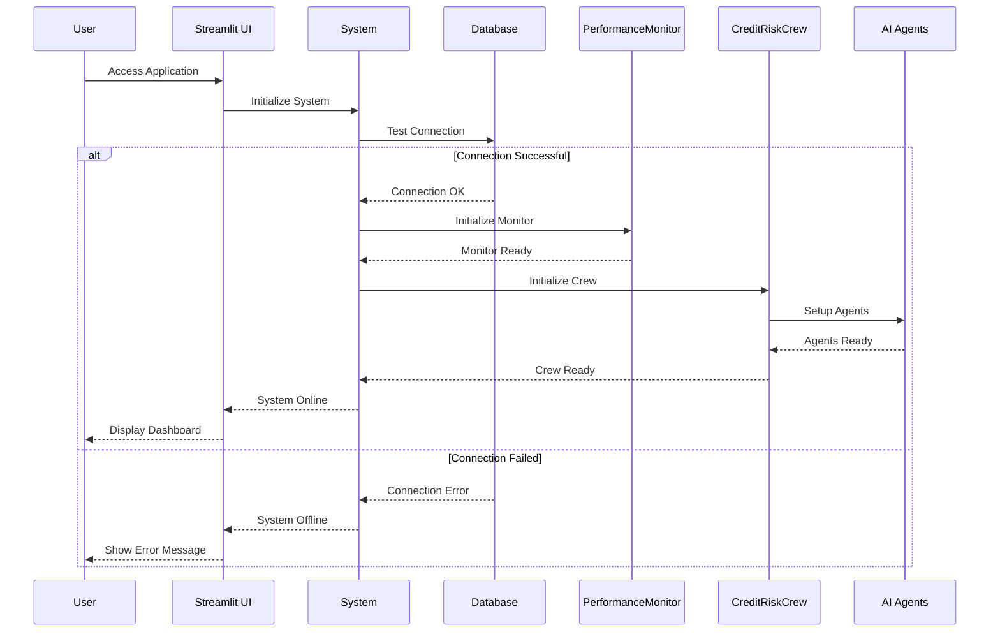
```mermaid
sequenceDiagram
    participant U as User
    participant UI as Streamlit UI
    participant S as System
    participant DB as Database
    participant PM as PerformanceMonitor
    participant C as CreditRiskCrew
    participant A as AI Agents

    U->>UI: Access Application
    UI->>S: Initialize System
    
    S->>DB: Test Connection
    alt Connection Successful
        DB-->>S: Connection OK
        S->>PM: Initialize Monitor
        PM-->>S: Monitor Ready
        
        S->>C: Initialize Crew
        C->>A: Setup Agents
        A-->>C: Agents Ready
        C-->>S: Crew Ready
        
        S-->>UI: System Online
        UI-->>U: Display Dashboard
    else Connection Failed
        DB-->>S: Connection Error
        S-->>UI: System Offline
        UI-->>U: Show Error Message
    end
```

---

## 🔍 Credit Risk Analysis Workflow

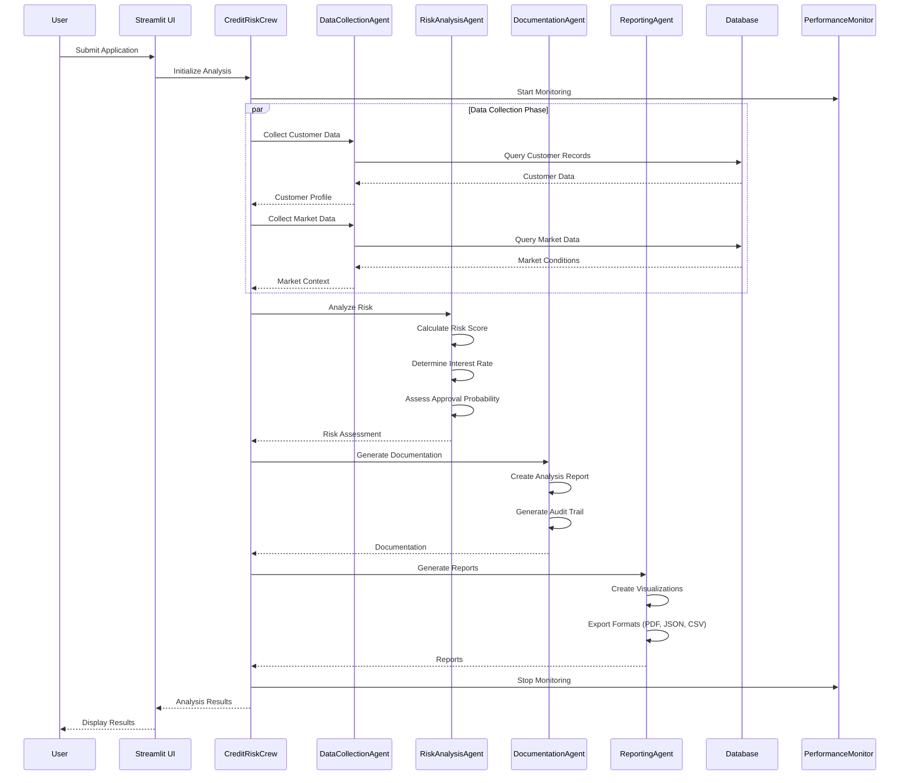
```mermaid
sequenceDiagram
    participant U as User
    participant UI as Streamlit UI
    participant C as CreditRiskCrew
    participant DC as DataCollectionAgent
    participant RA as RiskAnalysisAgent
    participant DA as DocumentationAgent
    participant RP as ReportingAgent
    participant DB as Database
    participant PM as PerformanceMonitor

    U->>UI: Submit Application
    UI->>C: Initialize Analysis
    C->>PM: Start Monitoring
    
    par Data Collection Phase
        C->>DC: Collect Customer Data
        DC->>DB: Query Customer Records
        DB-->>DC: Customer Data
        DC-->>C: Customer Profile
        
        C->>DC: Collect Market Data
        DC->>DB: Query Market Data
        DB-->>DC: Market Conditions
        DC-->>C: Market Context
    end
    
    C->>RA: Analyze Risk
    RA->>RA: Calculate Risk Score
    RA->>RA: Determine Interest Rate
    RA->>RA: Assess Approval Probability
    RA-->>C: Risk Assessment
    
    C->>DA: Generate Documentation
    DA->>DA: Create Analysis Report
    DA->>DA: Generate Audit Trail
    DA-->>C: Documentation
    
    C->>RP: Generate Reports
    RP->>RP: Create Visualizations
    RP->>RP: Export Formats (PDF, JSON, CSV)
    RP-->>C: Reports
    
    C->>PM: Stop Monitoring
    C-->>UI: Analysis Results
    UI-->>U: Display Results
```

---

## 🗄️ Database Operations Flow

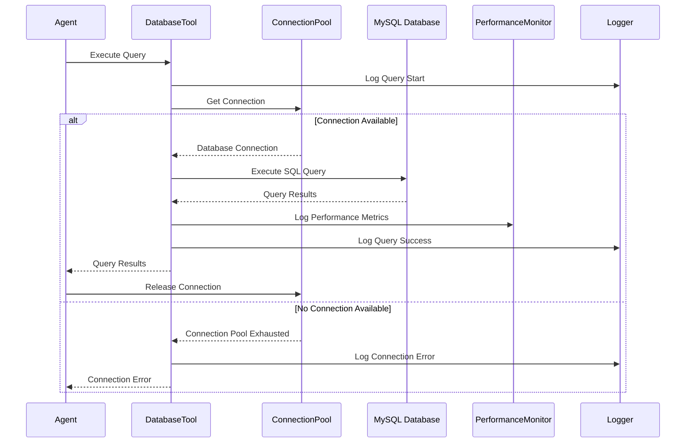
```mermaid
sequenceDiagram
    participant A as Agent
    participant DT as DatabaseTool
    participant CP as ConnectionPool
    participant DB as MySQL Database
    participant PM as PerformanceMonitor
    participant L as Logger

    A->>DT: Execute Query
    DT->>L: Log Query Start
    
    DT->>CP: Get Connection
    alt Connection Available
        CP-->>DT: Database Connection
        DT->>DB: Execute SQL Query
        DB-->>DT: Query Results
        
        DT->>PM: Log Performance Metrics
        DT->>L: Log Query Success
        DT-->>A: Query Results
        
        A->>CP: Release Connection
    else No Connection Available
        CP-->>DT: Connection Pool Exhausted
        DT->>L: Log Connection Error
        DT-->>A: Connection Error
    end
```

---

## 🤖 AI Agent Communication

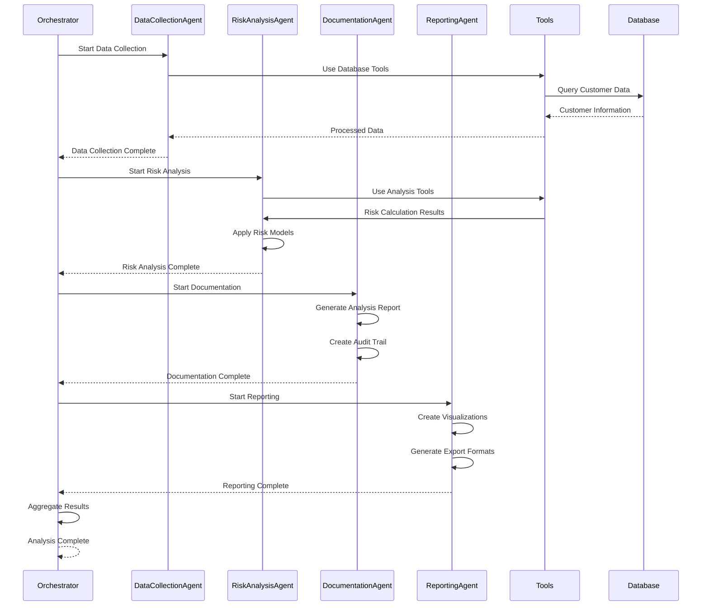
```mermaid
sequenceDiagram
    participant O as Orchestrator
    participant DC as DataCollectionAgent
    participant RA as RiskAnalysisAgent
    participant DA as DocumentationAgent
    participant RP as ReportingAgent
    participant T as Tools
    participant DB as Database

    O->>DC: Start Data Collection
    DC->>T: Use Database Tools
    T->>DB: Query Customer Data
    DB-->>T: Customer Information
    T-->>DC: Processed Data
    DC-->>O: Data Collection Complete
    
    O->>RA: Start Risk Analysis
    RA->>T: Use Analysis Tools
    T->>RA: Risk Calculation Results
    RA->>RA: Apply Risk Models
    RA-->>O: Risk Analysis Complete
    
    O->>DA: Start Documentation
    DA->>DA: Generate Analysis Report
    DA->>DA: Create Audit Trail
    DA-->>O: Documentation Complete
    
    O->>RP: Start Reporting
    RP->>RP: Create Visualizations
    RP->>RP: Generate Export Formats
    RP-->>O: Reporting Complete
    
    O->>O: Aggregate Results
    O-->>O: Analysis Complete
```

---

## ⚠️ Error Handling & Recovery

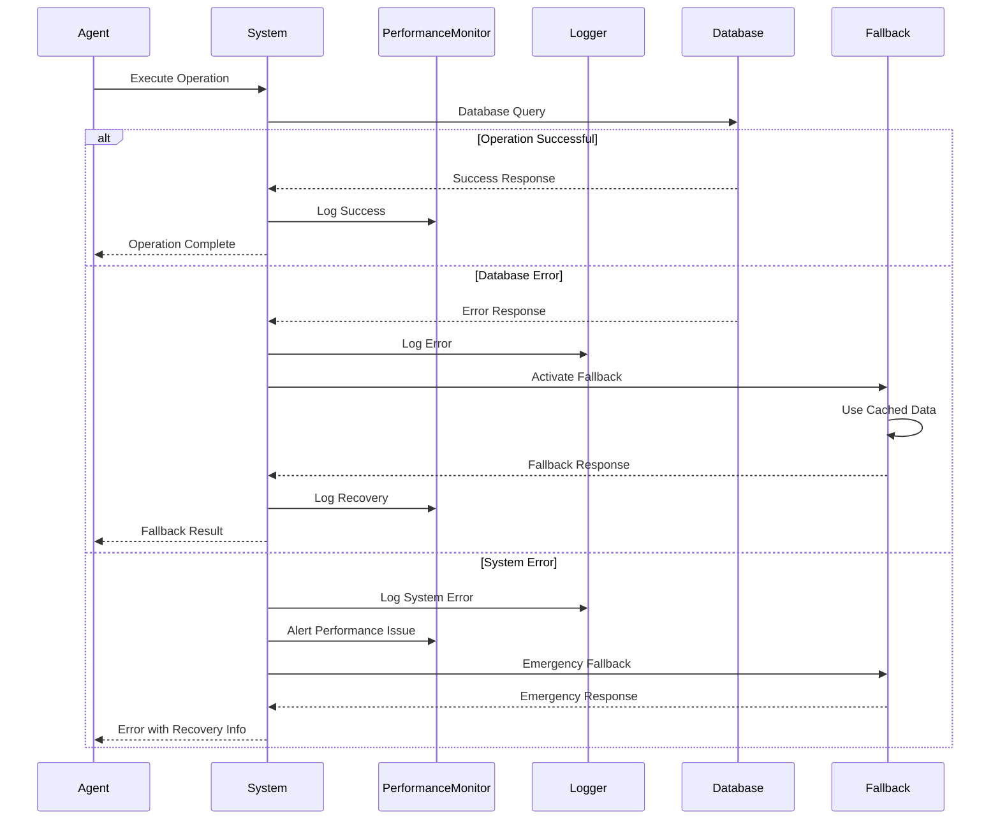
```mermaid
sequenceDiagram
    participant A as Agent
    participant S as System
    participant PM as PerformanceMonitor
    participant L as Logger
    participant DB as Database
    participant F as Fallback

    A->>S: Execute Operation
    S->>DB: Database Query
    
    alt Operation Successful
        DB-->>S: Success Response
        S->>PM: Log Success
        S-->>A: Operation Complete
    else Database Error
        DB-->>S: Error Response
        S->>L: Log Error
        S->>F: Activate Fallback
        F->>F: Use Cached Data
        F-->>S: Fallback Response
        S->>PM: Log Recovery
        S-->>A: Fallback Result
    else System Error
        S->>L: Log System Error
        S->>PM: Alert Performance Issue
        S->>F: Emergency Fallback
        F-->>S: Emergency Response
        S-->>A: Error with Recovery Info
    end
```

---

## 📊 Performance Monitoring Flow

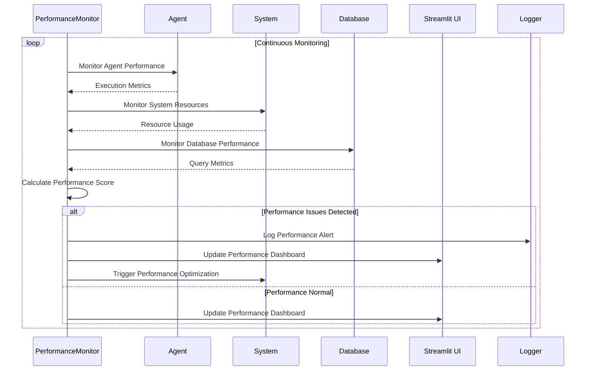
```mermaid
sequenceDiagram
    participant PM as PerformanceMonitor
    participant A as Agent
    participant S as System
    participant DB as Database
    participant UI as Streamlit UI
    participant L as Logger

    loop Continuous Monitoring
        PM->>A: Monitor Agent Performance
        A-->>PM: Execution Metrics
        
        PM->>S: Monitor System Resources
        S-->>PM: Resource Usage
        
        PM->>DB: Monitor Database Performance
        DB-->>PM: Query Metrics
        
        PM->>PM: Calculate Performance Score
        
        alt Performance Issues Detected
            PM->>L: Log Performance Alert
            PM->>UI: Update Performance Dashboard
            PM->>S: Trigger Performance Optimization
        else Performance Normal
            PM->>UI: Update Performance Dashboard
        end
    end
```

---

## 🔄 Data Generation Process

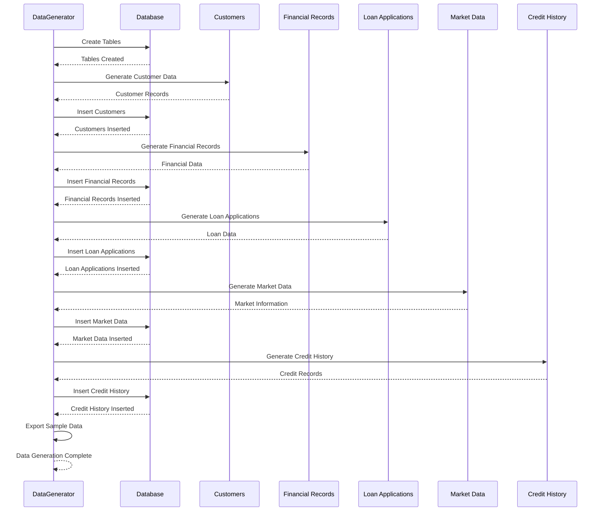
```mermaid
sequenceDiagram
    participant DG as DataGenerator
    participant DB as Database
    participant C as Customers
    participant F as Financial Records
    participant L as Loan Applications
    participant M as Market Data
    participant CH as Credit History

    DG->>DB: Create Tables
    DB-->>DG: Tables Created
    
    DG->>C: Generate Customer Data
    C-->>DG: Customer Records
    DG->>DB: Insert Customers
    DB-->>DG: Customers Inserted
    
    DG->>F: Generate Financial Records
    F-->>DG: Financial Data
    DG->>DB: Insert Financial Records
    DB-->>DG: Financial Records Inserted
    
    DG->>L: Generate Loan Applications
    L-->>DG: Loan Data
    DG->>DB: Insert Loan Applications
    DB-->>DG: Loan Applications Inserted
    
    DG->>M: Generate Market Data
    M-->>DG: Market Information
    DG->>DB: Insert Market Data
    DB-->>DG: Market Data Inserted
    
    DG->>CH: Generate Credit History
    CH-->>DG: Credit Records
    DG->>DB: Insert Credit History
    DB-->>DG: Credit History Inserted
    
    DG->>DG: Export Sample Data
    DG-->>DG: Data Generation Complete
```

---

## 📄 Report Generation Flow

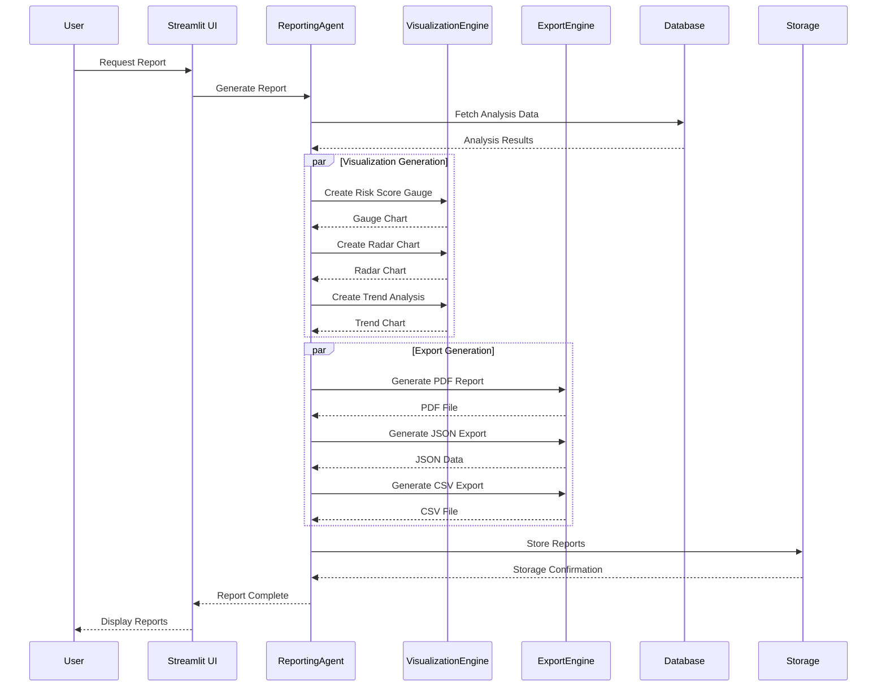
```mermaid
sequenceDiagram
    participant U as User
    participant UI as Streamlit UI
    participant RP as ReportingAgent
    participant V as VisualizationEngine
    participant E as ExportEngine
    participant DB as Database
    participant S as Storage

    U->>UI: Request Report
    UI->>RP: Generate Report
    
    RP->>DB: Fetch Analysis Data
    DB-->>RP: Analysis Results
    
    par Visualization Generation
        RP->>V: Create Risk Score Gauge
        V-->>RP: Gauge Chart
        
        RP->>V: Create Radar Chart
        V-->>RP: Radar Chart
        
        RP->>V: Create Trend Analysis
        V-->>RP: Trend Chart
    end
    
    par Export Generation
        RP->>E: Generate PDF Report
        E-->>RP: PDF File
        
        RP->>E: Generate JSON Export
        E-->>RP: JSON Data
        
        RP->>E: Generate CSV Export
        E-->>RP: CSV File
    end
    
    RP->>S: Store Reports
    S-->>RP: Storage Confirmation
    
    RP-->>UI: Report Complete
    UI-->>U: Display Reports
```

---

## 🔐 Authentication & Authorization Flow

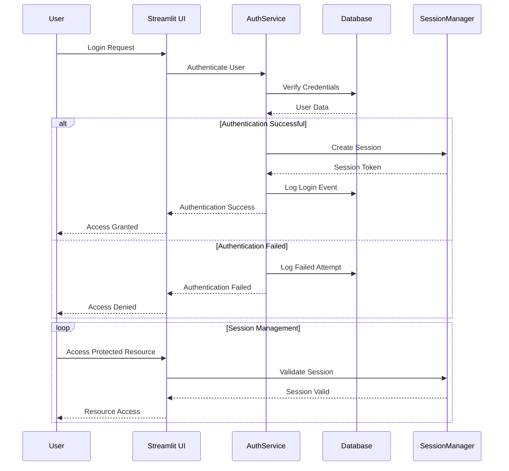
```mermaid
sequenceDiagram
    participant U as User
    participant UI as Streamlit UI
    participant A as AuthService
    participant DB as Database
    participant S as SessionManager

    U->>UI: Login Request
    UI->>A: Authenticate User
    
    A->>DB: Verify Credentials
    DB-->>A: User Data
    
    alt Authentication Successful
        A->>S: Create Session
        S-->>A: Session Token
        A->>DB: Log Login Event
        A-->>UI: Authentication Success
        UI-->>U: Access Granted
    else Authentication Failed
        A->>DB: Log Failed Attempt
        A-->>UI: Authentication Failed
        UI-->>U: Access Denied
    end
    
    loop Session Management
        U->>UI: Access Protected Resource
        UI->>S: Validate Session
        S-->>UI: Session Valid
        UI-->>U: Resource Access
    end
```

---

## 🔄 Real-time Updates Flow

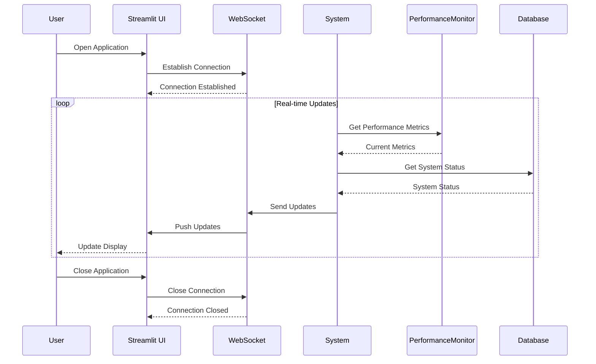
```mermaid
sequenceDiagram
    participant U as User
    participant UI as Streamlit UI
    participant WS as WebSocket
    participant S as System
    participant PM as PerformanceMonitor
    participant DB as Database

    U->>UI: Open Application
    UI->>WS: Establish Connection
    WS-->>UI: Connection Established
    
    loop Real-time Updates
        S->>PM: Get Performance Metrics
        PM-->>S: Current Metrics
        
        S->>DB: Get System Status
        DB-->>S: System Status
        
        S->>WS: Send Updates
        WS->>UI: Push Updates
        UI-->>U: Update Display
    end
    
    U->>UI: Close Application
    UI->>WS: Close Connection
    WS-->>UI: Connection Closed
```

---

## 🚨 Alert & Notification Flow

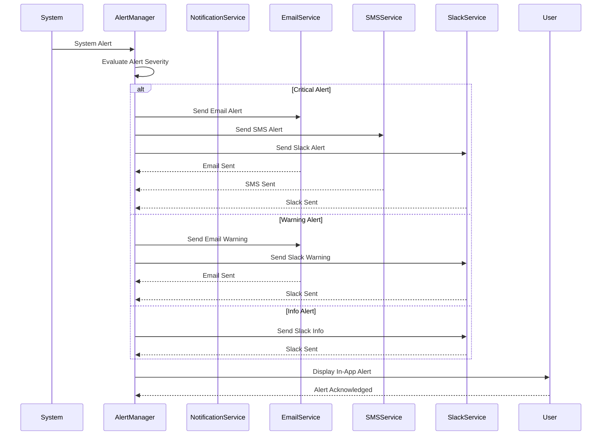
```mermaid
sequenceDiagram
    participant S as System
    participant AM as AlertManager
    participant N as NotificationService
    participant E as EmailService
    participant SMS as SMSService
    participant SL as SlackService
    participant U as User

    S->>AM: System Alert
    AM->>AM: Evaluate Alert Severity
    
    alt Critical Alert
        AM->>E: Send Email Alert
        AM->>SMS: Send SMS Alert
        AM->>SL: Send Slack Alert
        E-->>AM: Email Sent
        SMS-->>AM: SMS Sent
        SL-->>AM: Slack Sent
    else Warning Alert
        AM->>E: Send Email Warning
        AM->>SL: Send Slack Warning
        E-->>AM: Email Sent
        SL-->>AM: Slack Sent
    else Info Alert
        AM->>SL: Send Slack Info
        SL-->>AM: Slack Sent
    end
    
    AM->>U: Display In-App Alert
    U-->>AM: Alert Acknowledged
```

---

## 📈 Analytics & Reporting Flow

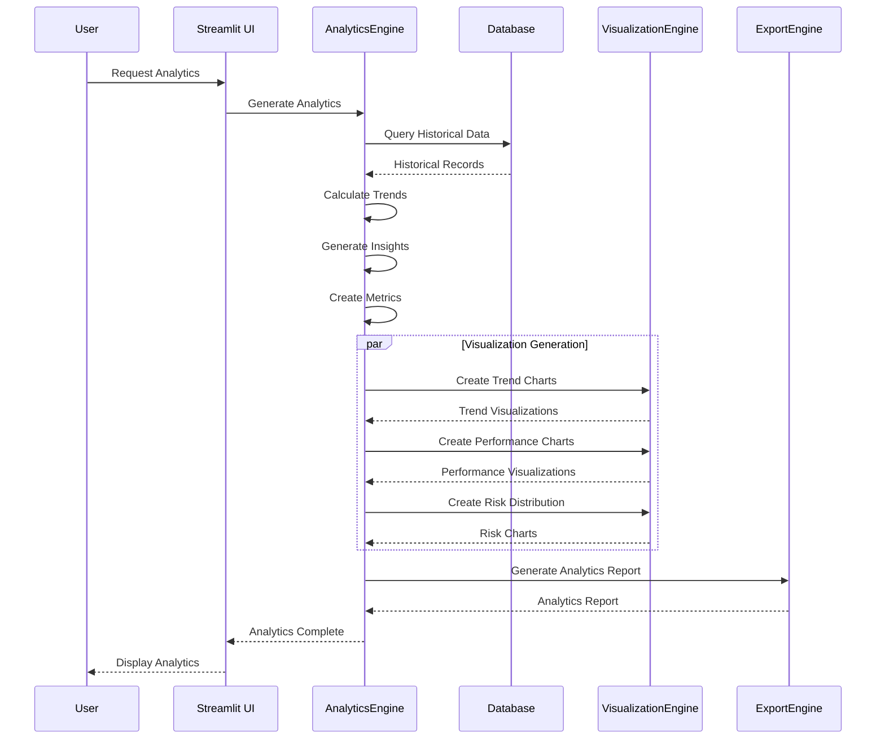
```mermaid
sequenceDiagram
    participant U as User
    participant UI as Streamlit UI
    participant A as AnalyticsEngine
    participant DB as Database
    participant V as VisualizationEngine
    participant E as ExportEngine

    U->>UI: Request Analytics
    UI->>A: Generate Analytics
    
    A->>DB: Query Historical Data
    DB-->>A: Historical Records
    
    A->>A: Calculate Trends
    A->>A: Generate Insights
    A->>A: Create Metrics
    
    par Visualization Generation
        A->>V: Create Trend Charts
        V-->>A: Trend Visualizations
        
        A->>V: Create Performance Charts
        V-->>A: Performance Visualizations
        
        A->>V: Create Risk Distribution
        V-->>A: Risk Charts
    end
    
    A->>E: Generate Analytics Report
    E-->>A: Analytics Report
    
    A-->>UI: Analytics Complete
    UI-->>U: Display Analytics
```

---

## 🔧 Configuration Management Flow

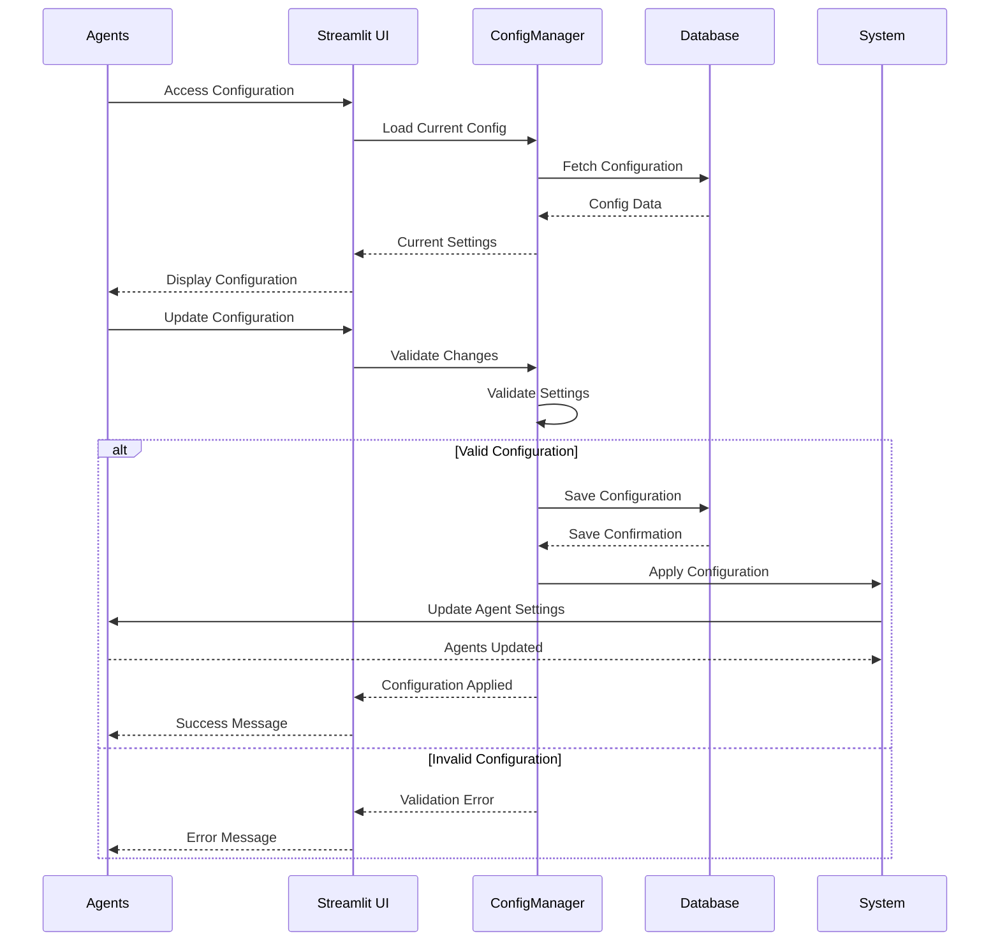
```mermaid
sequenceDiagram
    participant A as Admin
    participant UI as Streamlit UI
    participant CM as ConfigManager
    participant DB as Database
    participant S as System
    participant A as Agents

    A->>UI: Access Configuration
    UI->>CM: Load Current Config
    CM->>DB: Fetch Configuration
    DB-->>CM: Config Data
    CM-->>UI: Current Settings
    UI-->>A: Display Configuration
    
    A->>UI: Update Configuration
    UI->>CM: Validate Changes
    CM->>CM: Validate Settings
    
    alt Valid Configuration
        CM->>DB: Save Configuration
        DB-->>CM: Save Confirmation
        CM->>S: Apply Configuration
        S->>A: Update Agent Settings
        A-->>S: Agents Updated
        CM-->>UI: Configuration Applied
        UI-->>A: Success Message
    else Invalid Configuration
        CM-->>UI: Validation Error
        UI-->>A: Error Message
    end
```

---

## 🔄 Backup & Recovery Flow

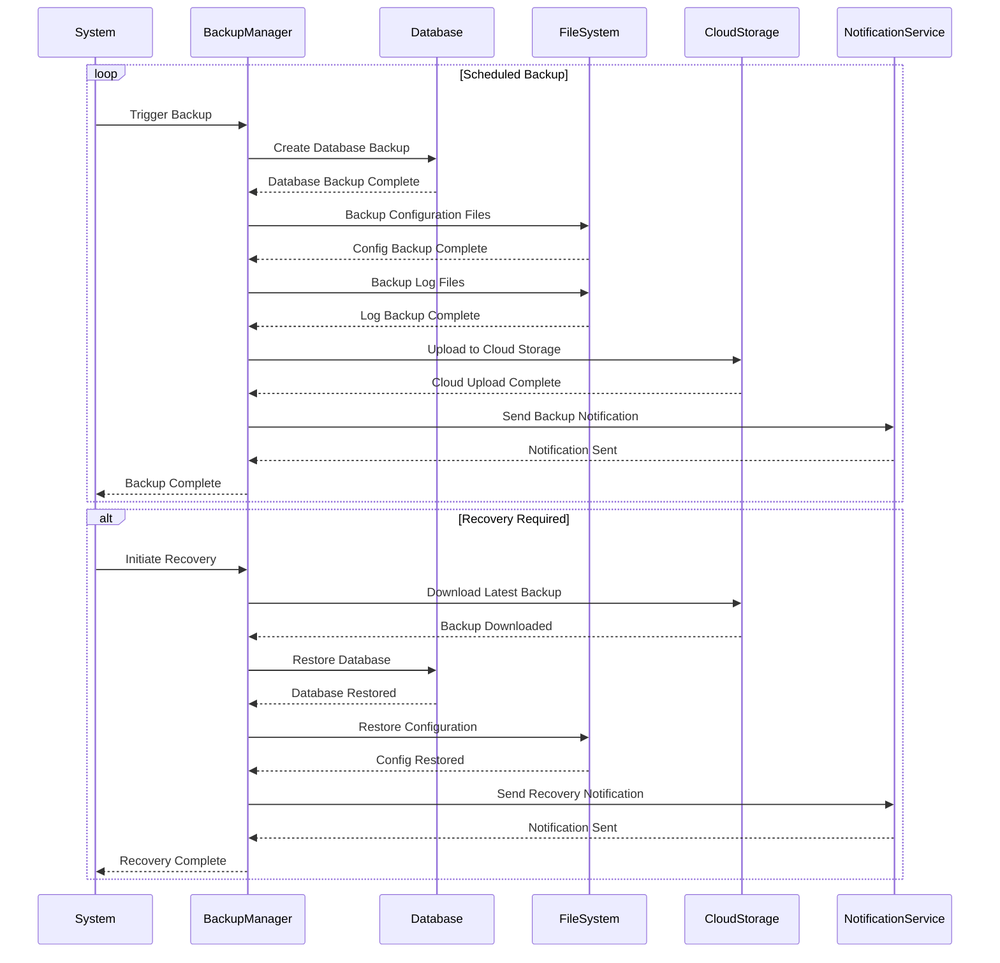
```mermaid
sequenceDiagram
    participant S as System
    participant BM as BackupManager
    participant DB as Database
    participant FS as FileSystem
    participant C as CloudStorage
    participant N as NotificationService

    loop Scheduled Backup
        S->>BM: Trigger Backup
        BM->>DB: Create Database Backup
        DB-->>BM: Database Backup Complete
        
        BM->>FS: Backup Configuration Files
        FS-->>BM: Config Backup Complete
        
        BM->>FS: Backup Log Files
        FS-->>BM: Log Backup Complete
        
        BM->>C: Upload to Cloud Storage
        C-->>BM: Cloud Upload Complete
        
        BM->>N: Send Backup Notification
        N-->>BM: Notification Sent
        
        BM-->>S: Backup Complete
    end
    
    alt Recovery Required
        S->>BM: Initiate Recovery
        BM->>C: Download Latest Backup
        C-->>BM: Backup Downloaded
        
        BM->>DB: Restore Database
        DB-->>BM: Database Restored
        
        BM->>FS: Restore Configuration
        FS-->>BM: Config Restored
        
        BM->>N: Send Recovery Notification
        N-->>BM: Notification Sent
        
        BM-->>S: Recovery Complete
    end
```

---

## 📊 Data Flow Architecture

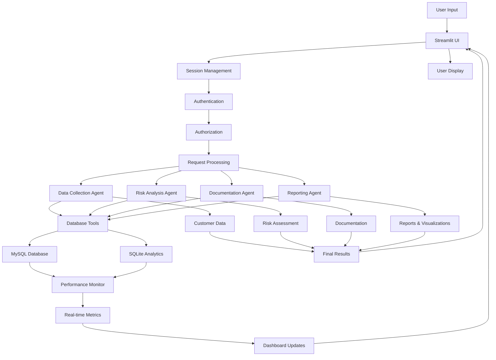
```mermaid
graph TD
    A[User Input] --> B[Streamlit UI]
    B --> C[Session Management]
    C --> D[Authentication]
    D --> E[Authorization]
    E --> F[Request Processing]
    
    F --> G[Data Collection Agent]
    F --> H[Risk Analysis Agent]
    F --> I[Documentation Agent]
    F --> J[Reporting Agent]
    
    G --> K[Database Tools]
    H --> K
    I --> K
    J --> K
    
    K --> L[MySQL Database]
    K --> M[SQLite Analytics]
    
    L --> N[Performance Monitor]
    M --> N
    
    N --> O[Real-time Metrics]
    O --> P[Dashboard Updates]
    P --> B
    
    G --> Q[Customer Data]
    H --> R[Risk Assessment]
    I --> S[Documentation]
    J --> T[Reports & Visualizations]
    
    Q --> U[Final Results]
    R --> U
    S --> U
    T --> U
    
    U --> B
    B --> V[User Display]
```

---

## 🔄 System Integration Flow

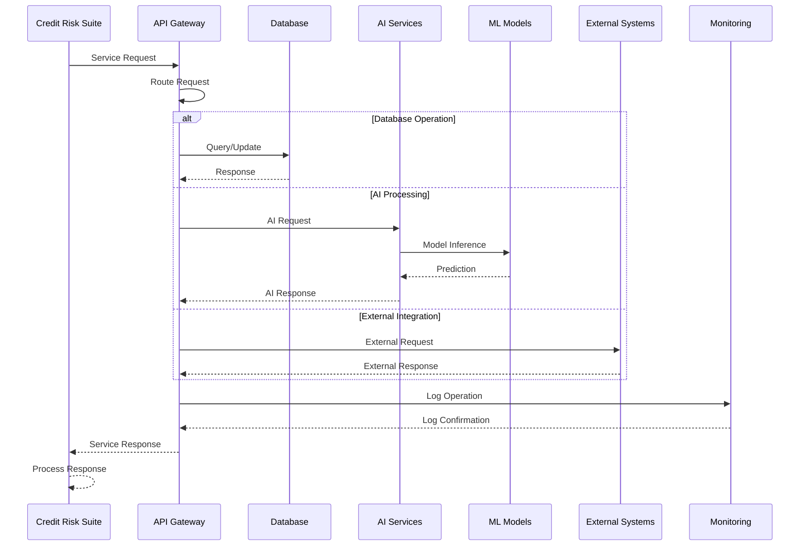
```mermaid
sequenceDiagram
    participant CR as Credit Risk Suite
    participant API as API Gateway
    participant DB as Database
    participant AI as AI Services
    participant ML as ML Models
    participant E as External Systems
    participant M as Monitoring

    CR->>API: Service Request
    API->>API: Route Request
    
    alt Database Operation
        API->>DB: Query/Update
        DB-->>API: Response
    else AI Processing
        API->>AI: AI Request
        AI->>ML: Model Inference
        ML-->>AI: Prediction
        AI-->>API: AI Response
    else External Integration
        API->>E: External Request
        E-->>API: External Response
    end
    
    API->>M: Log Operation
    M-->>API: Log Confirmation
    
    API-->>CR: Service Response
    CR-->>CR: Process Response
```

---

## 📋 Summary

These sequence diagrams provide a comprehensive view of the Credit Risk AI Suite's internal workflows and interactions. They can be used for:

1. **System Understanding**: Understanding how components interact
2. **Troubleshooting**: Identifying bottlenecks and failure points
3. **Performance Optimization**: Analyzing execution flows
4. **Documentation**: Creating technical documentation
5. **Training**: Onboarding new team members
6. **Presentations**: Explaining system architecture to stakeholders

Each diagram focuses on a specific aspect of the system, making it easier to understand and communicate complex workflows. 